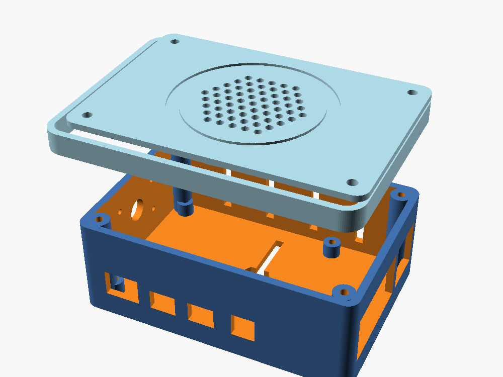

# OpenBabyMonitor — hardware & 3D-printed case

This folder documents the hardware add-ons for the **white noise** and **night
light** features and provides a parametric 3D-printed enclosure for a
**Raspberry Pi 4B** based build.



> ⚠️ **The case is a parametric starting point, not a verified drop-in fit.**
> The Raspberry Pi 4B port positions and the component sizes in
> [`case/babymonitor_case.scad`](case/babymonitor_case.scad) come from published
> data and common module dimensions, but tolerances vary. **Print a quick test
> of the port wall and verify the dimensions against your own parts before
> printing the whole case.**

## Bill of materials

| Part | Notes |
|------|-------|
| Raspberry Pi 4B | Has a native 3.5 mm audio output and plenty of USB ports. |
| microSD card (≥8 GB) | OS + OpenBabyMonitor. |
| USB-C power supply, 5 V **3 A+** | The Pi 4B needs 3 A; budget extra for the LED ring and amp. |
| USB microphone | Existing OpenBabyMonitor mic (audio input). |
| Raspberry Pi Camera Module v2 / **NoIR** | Optional; NoIR for night vision. CSI ribbon. |
| Small speaker, 3–5 W, 4–8 Ω, ⌀ ~38 mm | White noise output. |
| Audio amplifier — **PAM8403** (default) | Drives the speaker from the Pi's 3.5 mm jack. |
| *Alternative:* **MAX98357A** I²S amp | Higher quality; replaces the 3.5 mm path (see wiring). |
| WS2812 / NeoPixel ring, 12–16 LEDs, ⌀ ~52 mm | Night light. |
| **74AHCT125** level shifter | Shifts the Pi's 3.3 V data to 5 V for the WS2812 (recommended). |
| M2.5 screws/standoffs, ¼"-20 hex nut | Board mounting, lid screws, tripod mount. |
| White / natural **PLA** filament | Print the lid in a translucent colour so the LED ring glows through. |

## Wiring

The two features are independent and use **different pins**, so they do not
conflict. The defaults below match the software defaults.

### White noise (speaker)

Default path — analog out + PAM8403:

```
Pi 3.5 mm AV jack  ──►  PAM8403 audio IN (L/R + GND)
Pi 5V  (pin 2/4)   ──►  PAM8403 VCC
Pi GND (pin 6)     ──►  PAM8403 GND
PAM8403 OUT        ──►  speaker
```

The software plays through the ALSA default/headphone device
(`control/speaker.py` auto-detects it). No GPIO pins are used.

Alternative — MAX98357A over I²S (better quality; do **not** also use the 3.5 mm
path). Update `control/speaker.py` / ALSA to target the I²S card:

```
GPIO18 (pin 12, BCLK)  ──►  MAX98357A BCLK
GPIO19 (pin 35, LRC)   ──►  MAX98357A LRC
GPIO21 (pin 40, DIN)   ──►  MAX98357A DIN
5V / GND               ──►  MAX98357A VIN / GND
MAX98357A OUT          ──►  speaker
```

### Night light (WS2812 ring over SPI)

```
GPIO10 / MOSI (pin 19) ──►  74AHCT125 in  ──►  ring DIN
Pi 5V  (pin 2/4)       ──►  74AHCT125 VCC + ring 5V
Pi GND (pin 6)         ──►  74AHCT125 GND + ring GND
```

- SPI is enabled and the user is added to the `spi` group by `setup_device.sh`,
  so the `bm_nightlight` service drives the LEDs **without root**.
- Set the LED count with the `BM_NIGHTLIGHT_NUM_LEDS` environment variable if
  your ring is not 12 LEDs (see `control/nightlight.py`).
- A 12–16 LED ring at full white can draw ~0.5–1 A. If you push brightness high,
  power the ring from a separate 5 V supply (common ground) rather than the Pi.

### GPIO pin summary

| Function | Pin | GPIO |
|----------|-----|------|
| WS2812 data (SPI MOSI) | 19 | GPIO10 |
| 5 V | 2 / 4 | — |
| GND | 6 / 9 / 14 | — |
| I²S (only if using MAX98357A) | 12 / 35 / 40 | GPIO18 / 19 / 21 |

## The 3D-printed case

Two parts: a **base** tray that holds the Pi and a **lid** that carries the
speaker (top-firing through a grille) and the LED ring (behind a thin diffuser
window). Features: standoffs for the Pi's M2.5 holes, side port cut-outs,
ventilation slots, a camera lens hole + M2 mounts on a short wall, four corner
screw posts, and a ¼"-20 hex-nut pocket on the underside for tripod mounting
(keeping the existing tripod workflow).

### Files

- [`case/babymonitor_case.scad`](case/babymonitor_case.scad) — parametric source;
  all dimensions are variables in the `PARAMETERS` block.
- `case/babymonitor_case_base.stl`, `case/babymonitor_case_lid.stl` — exported
  meshes (each is a single, manifold solid).
- `case/preview.png` — rendered preview.

### Regenerate the STLs

```bash
cd hardware/case
openscad -D 'part="base"' -o babymonitor_case_base.stl babymonitor_case.scad
openscad -D 'part="lid"'  -o babymonitor_case_lid.stl  babymonitor_case.scad
```

Open the `.scad` in OpenSCAD with `part="both"` to preview the assembly.

### Suggested print settings

- Material: **PLA**; print the **lid in white/natural** so the night light
  diffuses through the thin window. The export already orients the lid top-down.
- Layer height 0.2 mm, 3 perimeters, 15–20 % infill.
- Supports: only needed for the camera hole / port walls (minimal).

### Assembly

1. Verify the port wall fits your Pi (print a test slice first).
2. Screw the Pi onto the base standoffs (M2.5).
3. Wire the amp + speaker and the level shifter + LED ring as above.
4. Seat the speaker and the LED ring in the lid retainers; route the camera
   ribbon to the lens hole.
5. Close the lid over the base and fix with four M2.5 screws into the corner
   posts. Fit a ¼"-20 nut in the base pocket for the tripod.
